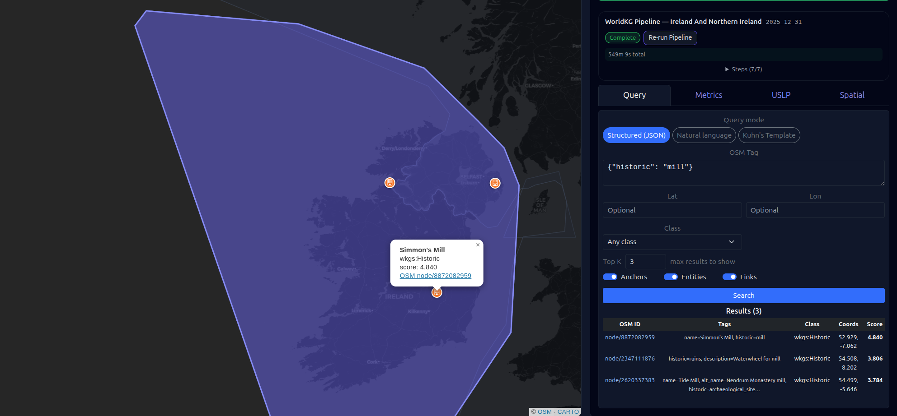
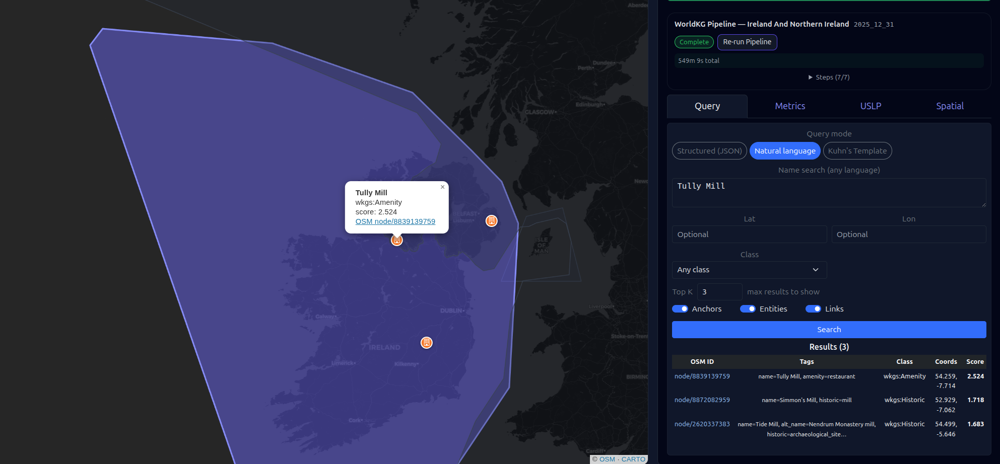
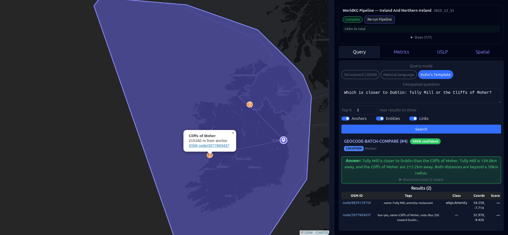

# WorldKG Pipeline and Geo-Spatial Agents

The WorldKG pipeline transforms noisy and unstructured open source data
from OSM and Wikidata into clean, structured knowledge.
The artifacts include vector embeddings, Wikidata-aligned entities, and predicted
spatial links.


### Processing a Country

Before you can query a country, the pipeline needs to process it. The
sidebar walks you through the flow:

1. **Select a country**: Search or pick a country from the sidebar list.
   Each country shows a badge indicating whether it has already been
   preprocessed (green "Preprocessed") or not (grey "Not Preprocessed").

2. **Choose a snapshot year**: The year selector scopes the pipeline run
   to a specific OSM snapshot date. Years that have already been processed
   show a checkmark; selecting one again re-runs the pipeline for that
   snapshot.

3. **Run the pipeline**: Click the pipeline button in the sidebar. The
   progress panel appears below it, showing each step as it runs
   (embedding, enrichment, alignment, link prediction) with a progress
   bar and running stats (entity count, aligned count, spatial link
   count).

4. **Explore the results**: When the pipeline finishes, four tabs
   appear in the sidebar panel:

   | Tab | What it shows |
   |---|---|
   | **Query** | The three query modes (below) for asking questions about the processed country |
   | **Metrics** | Step-by-step breakdown of the pipeline run: status, duration, and summary per step |
   | **USLP** | Predicted spatial links: accepted/rejected counts, acceptance rate, score distribution, and map toggles |
   | **Spatial** | Subgraph coverage: subgraph cards with availability badges and node/way counts |

   Results also appear as overlays on the map. Search hits, query
   results, and link geometries render directly on the Leaflet surface.


### Query Modes

The Query tab supports three modes that can be tested independently:

**Structured (JSON)**: The user enters OSM tags as JSON (e.g.
`{"amenity": "cafe"}`) or a name in any language (e.g.
`{"name": "파리바게뜨"}`). Uses FastText semantic embeddings + the
romanizing framework for cross-script name matching (Hangul↔Latin,
diacritic stripping for French/Spanish/Irish, etc.). The romanizer
auto-detects the script from the text, no language selection needed.


**Natural language**: The user types a name in any language or script
(e.g. "paris bagueete", "파리바게뜨", "café", "원탕"). The romanizer
activates for cross-script matching (e.g., English "paris bagueete"
matching Korean "파리바게뜨"). FastText provides semantic type matching
as a complementary signal.


**Kuhn's Template**: The user types a full geospatial question (e.g.
"Which bars are within 50m of Hollywood Blvd?"). The parser (TF-IDF +
Naive Bayes) classifies it into one of 9 templates with confidence
scores, and the parsed concepts are displayed for review. The 3-tier
amenity fallback (exact tag → ontology class → FastText semantic) traces
each resolution step so the user sees exactly how a concept like "bar"
was resolved. This mode is completely separate from the other two; it
uses its own parser and executor, and can be tested independently.



<!-- TODO add MapQA type to the GUI as key to the template number that is shown -->
The parser is trained on the public MapQA
dataset and on self-supervised question–answer pairs generated from our
own OSM data, so the templates learn the phrasings and toponyms of the
countries the pipeline has actually processed. When a user submits a
question through Kuhn's template mode, the result is summarized by an
open-source AI agent (QwenAgent) that grounds its answer in the template
output and the underlying entity data.

<!-- TODO: replace this diagram with image-->
```
User types: "Which cafes are within 2km of a school?"

┌──────────────────────────────────────────────────────────┐
│  Step 1: REQUEST                                         │
│  Question enters the system                              │
└──────────────────────────┬───────────────────────────────┘
                           ▼
┌──────────────────────────────────────────────────────────┐
│  Step 2: PARSER                                          │
│  Classifies the question → "find things near a place"    │
└──────────────────────────┬───────────────────────────────┘
                           ▼
┌──────────────────────────────────────────────────────────┐
│  Step 3: TEMPLATE MATCH                                  │
│  Matches the question's classification to a template     │
│  "filter-aggregate-measure" template                     │
└──────────────────────────┬───────────────────────────────┘
                           ▼
┌──────────────────────────────────────────────────────────┐
│  Step 4: EXECUTION                                       │
│  Extracts: what (cafes), where (a school),               │
│            how far (2km)                                 │
│  Template executes against the WorldKG artifacts         │
│  (entity types, spatial relationships, embeddings)       │
│  ← 5 cafes within 2km of the school                      │
└──────────────────────────┬───────────────────────────────┘
                           ▼
┌──────────────────────────────────────────────────────────┐
│  Step 5: RESULTS                                         │
│  Human receives the results, no interpretation           │
└──────────────────────────────────────────────────────────┘
```
<!-- TODO: insert image here -->


### Types of Questions the Templates Handle Well

The templating system succeeds with questions that map to the artifacts
the pipeline produces: entity types (from WorldKG ontology classes),
spatial relationships (from USLP link prediction), semantic similarity
(from GeoVectors embeddings), and cross-script names (from the
romanizer). The table below shows all 10 macro-templates from the
Spatial-Agent paper, the example questions we use, and the coverage
each template has in the parser's training data.

**Ireland: 2025_12_31**

```
┌──────────────────────────────┬────────────────────────────────────────────────────────────────┬──────────────────────────────────┬──────────┐
│ Question type                │ English                                                        │ Template Type                    │ Coverage │
├──────────────────────────────┼────────────────────────────────────────────────────────────────┼──────────────────────────────────┼──────────┤
│ Find things near a place     │ "Which cafes are within 2km of a school?"                      │ FILTER-AGGREGATE-MEASURE         │ 21%      │
├──────────────────────────────┼────────────────────────────────────────────────────────────────┼──────────────────────────────────┼──────────┤
│ Find the nearest X           │ "What is the nearest cafe to  ?"                   │ GEOCODE-BATCH-COMPARE            │ 25%      │
├──────────────────────────────┼────────────────────────────────────────────────────────────────┼──────────────────────────────────┼──────────┤
│ Compare distances            │ "Which is closer to Dublin: Tully Mill or the Cliffs of Moher?" │ GEOCODE-BATCH-COMPARE         │ 25%      │
├──────────────────────────────┼────────────────────────────────────────────────────────────────┼──────────────────────────────────┼──────────┤
│ What's around here           │ "What amenities are around Tully Mill?"                        │ PLACE-ATTRIBUTE-QUERY            │ 19%      │
├──────────────────────────────┼────────────────────────────────────────────────────────────────┼──────────────────────────────────┼──────────┤
│ Direction from a place       │ "What is west of Tullygally Tavern?"                           │ LOCATION-BEARING-CLASSIFY        │ 17%      │
├──────────────────────────────┼────────────────────────────────────────────────────────────────┼──────────────────────────────────┼──────────┤
│ How far is X from Y          │ "How far is Betelnut Cafe from Dublin?"                        │ OBJECT-FIELD-MEASURE             │ 17%      │
├──────────────────────────────┼────────────────────────────────────────────────────────────────┼──────────────────────────────────┼──────────┤
│ Optimal visiting order       │ "What's the best order to visit these 5 cafes?"                │ ROUTE-OPTIMIZE                   │ 0%       │
├──────────────────────────────┼────────────────────────────────────────────────────────────────┼──────────────────────────────────┼──────────┤
│ Navigation maneuvers         │ "What turns do I take to get to the pub?"                      │ ROUTE-STEP-EXTRACT               │ 0%       │
├──────────────────────────────┼────────────────────────────────────────────────────────────────┼──────────────────────────────────┼──────────┤
│ Compare routes               │ "Which route to Dublin is faster: M1 or M7?"                   │ MULTI-ROUTE-COMPARE              │ 0%       │
├──────────────────────────────┼────────────────────────────────────────────────────────────────┼──────────────────────────────────┼──────────┤
│ Multi-leg journey            │ "How long is the bus and train trip to Cork?"                  │ MULTI-SEGMENT-AGGREGATE          │ 0%       │
├──────────────────────────────┼────────────────────────────────────────────────────────────────┼──────────────────────────────────┼──────────┤
│ Latest departure time        │ "What's the latest I can leave to arrive by 5pm?"              │ TIME-WINDOW-REVERSE              │ 0%       │
└──────────────────────────────┴────────────────────────────────────────────────────────────────┴──────────────────────────────────┴──────────┘
```


The 5 templates with coverage are trained and operational. The remaining
5 templates from the paper (routing and navigation patterns) have no
training data yet and are future work.


### System Summary

The System Summary modal (accessible from the header) is the operational
dashboard for verifying pipeline prerequisites. It shows the overall
system state across five tabs:

- **Overview**: planet PBF size and availability
- **Embeddings**: GV-Tags / GV-NLE scan status/home/thanos/projects/world-knowledge-graph-pipeline/frontend-v3/src/assets/Query_By_Natural_Language.png
- **Storage**: database and partition status
- **Paths**: country and subgraph file paths
- **History**: pipeline run history

This is where you confirm that planet initialization completed and all
prerequisites are in place before running a country pipeline.

<!-- TODO: Add screenshot: System summary modal on the overview tab -->


### Predicted Links (USLP)

The USLP tab shows the output of the pipeline's spatial link prediction
stage. A predicted link is a spatial relationship between two OSM
entities that the pipeline has inferred from their geometry, proximity,
and semantic similarity. For example, a cafe that is "near" a train
station, or a school that is "within" a residential area.

Each predicted link is scored and either accepted or rejected based on a
confidence threshold. The USLP tab displays:

- **Summary metrics**: accepted count, rejected count, acceptance rate,
  and total entity count
- **Score distribution**: a histogram showing how links are spread
  across confidence scores
- **Map toggles**: buttons to render accepted links (green) and rejected
  links (red) as geometries on the map, so you can visually inspect what
  the pipeline predicted and where

---

## Open-Source Technology Choices

The platform is built entirely on open-source components. The table below
shows the choices made for this project versus the closed-source or
commercial alternatives that are common in ML and geospatial systems.

```
┌──────────────────────┬──────────────────────────────────────┬──────────────────────────────────────────────┐
│ Component            │ This project (open-source)           │ Common closed-source / commercial alternative│
├──────────────────────┼──────────────────────────────────────┼──────────────────────────────────────────────┤
│ Text embeddings      │ FastText (cc.en.300.bin, 300D)       │ OpenAI text-embedding-3-small/large          │
│                      │ trained on Common Crawl, runs        │ API-only, per-token pricing, data leaves     │
│                      │ locally, no API costs                │ your infrastructure                          │
├──────────────────────┼──────────────────────────────────────┼──────────────────────────────────────────────┤
│ Vector database      │ pgvector (PostgreSQL extension)      │ Pinecone, Weaviate Cloud                     │
│                      │ HNSW indexes inside the same DB      │ managed services, vendor lock-in,            │
│                      │ as the entity data, no sync          │ separate infrastructure to maintain          │
├──────────────────────┼──────────────────────────────────────┼──────────────────────────────────────────────┤
│ LLM / agent          │ Qwen3 14B via Ollama (local GPU)     │ OpenAI GPT-4, Anthropic Claude               │
│                      │ runs on-device, no data leaves,      │ API-only, per-call pricing, rate limits,     │
│                      │ no per-call cost, no rate limits     │ data sent to third-party servers             │
├──────────────────────┼──────────────────────────────────────┼──────────────────────────────────────────────┤
│ Language /           │ Custom romanizer (phonetic script    │ Google Translate API, DeepL                  │
│ romanization         │ detection, Hangul↔Latin, diacritic   │ API-only, per-character pricing,             │
│                      │ stripping, deterministic, no model)  │ non-deterministic output                     │
├──────────────────────┼──────────────────────────────────────┼──────────────────────────────────────────────┤
│ Spatial database     │ PostgreSQL + PostGIS                 │ Oracle Spatial, Esri ArcGIS                  │
│                      │ full spatial SQL, GiST indexes,      │ licensed, expensive, vendor-specific         │
│                      │ partitioning, free                   │ query languages                              │
├──────────────────────┼──────────────────────────────────────┼──────────────────────────────────────────────┤
│ Backend framework    │ Django + Django REST Framework       │ Proprietary / cloud-native services          │
│                      │ Python, mature, large ecosystem      │ vendor lock-in, limited extensibility        │
├──────────────────────┼──────────────────────────────────────┼──────────────────────────────────────────────┤
│ Frontend / map       │ Vue 3 + Leaflet                      │ Google Maps API, Mapbox                      │
│                      │ reactive SPA, open map tiles,        │ per-load pricing, API key requirements,      │
│                      │ no map usage fees                    │ usage limits                                 │
├──────────────────────┼──────────────────────────────────────┼──────────────────────────────────────────────┤
│ OSM data processing  │ osmium-tool                          │ Proprietary geo-processing pipelines         │
│                      │ fast PBF extraction & filtering,     │ licensed, limited customization,             │
│                      │ full control over the pipeline       │ black-box processing                         │
├──────────────────────┼──────────────────────────────────────┼──────────────────────────────────────────────┤
│ Task orchestration   │ Celery + Redis                       │ AWS Step Functions, Google Cloud Tasks       │
│                      │ local, no cloud vendor dependency    │ cloud-locked, per-transition pricing         │
└──────────────────────┴──────────────────────────────────────┴──────────────────────────────────────────────┘
```

The trade-off is operational: open-source components require you to host,
monitor, and scale them yourself. The benefit is full control over data
residency, no per-call or per-token costs, no rate limits, and no vendor
lock-in. All of which matter for a system that processes millions of
OSM entities and serves interactive queries.

---

## Quickstart

```bash
docker compose -f docker-compose.yml -f compose.override.yml up -d
cd frontend-v3 && npm install && npm run dev
```

---

## What's Next?
- Baseline tests: Ovid and Drift Tests
- Add support for more languages
- CityFM Support
- Named-entity anchor resolution (unique business names → OSM coordinates)
