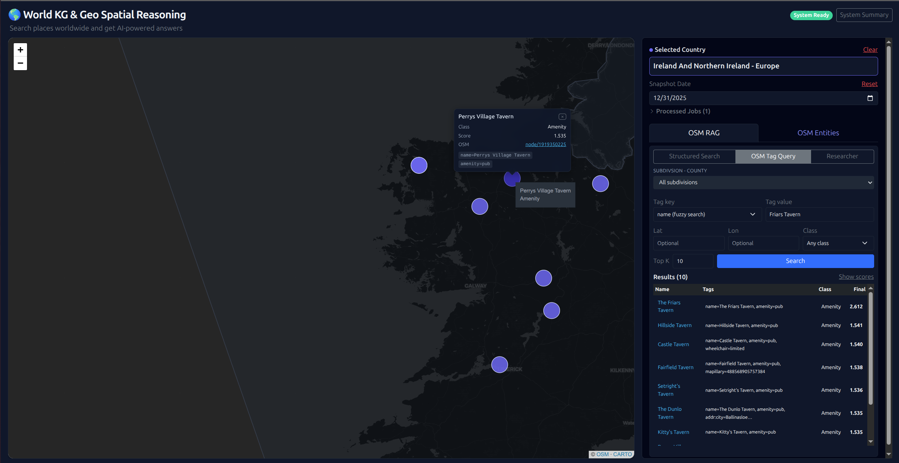
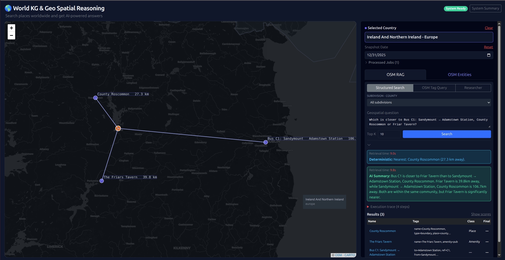

# World KG & Geo Spatial Reasoning

Live: [thanos.tail560528.ts.net](https://thanos.tail560528.ts.net/)

Search places worldwide and get AI-powered answers. The app turns raw
OpenStreetMap data into a searchable knowledge base, then lets you ask
questions about any country it has processed and get grounded answers
on an interactive map.

Pick a country, run the pipeline, and ask a question like "Which cafes
are within 2km of a school?" The app parses the question, finds the
matching places, shows them on the map, and writes a short AI summary
that explains what it found and why.

## What it does

Three things, each building on the last:

1. **Processes a country.** The pipeline reads OpenStreetMap data for
   a country, builds vector embeddings of every place, aligns places
   with Wikidata, and predicts spatial relationships between them. One
   run takes a few minutes on a GPU; the results are stored and ready
   to query.

2. **Searches the results three ways.** Search by OSM tag or by name in
   any language or script, ask a full structured sentence, or hand the
   whole task to the research planner. The tag and name lookups are
   fast; the structured search parses your sentence, runs it against
   the stored data, and summarizes the answer; the planner chains both
   into a multi-step research task.

3. **Answers questions with grounded AI.** The AI summary cites the
   actual places, their tags, and the spatial relationships the
   pipeline predicted. It is not a generic chatbot answer. It is
   grounded in the data the pipeline produced for the country you
   selected.

## Three ways to search

### 1. Search by OSM tag

Semantic name search: type a name in any language or script, like
"Friar's Tavern", and the search matches it without the exact string
(the data stores "The Friars Tavern"). FastText provides the semantic
class matching, and a re-ranking score prioritizes results by name
similarity, distance, and predicted spatial links. The romanizer
auto-detects the script for cross-script matching.

### 2. Search by a structured sentence

Type a full geospatial question (e.g. "Which bars are within 50m of
Hollywood Blvd?"). The app shows you what it understood, you approve
or edit, and it runs.

Every question returns two answers. The **deterministic answer** is
computed directly from the data and lands first, with its retrieval
time shown. The **AI summary** streams in after, grounded in that same
result and enriched with extra context orchestrated by an open-source
LLM, with its own retrieval time shown.

The **execution trace** (collapsible) shows every decision the system
made: which template matched the question, at what confidence, and how
each concept resolved, similar to the reasoning logs of thinking
agents.

**Question types.** The structured search handles questions that map to
the data the pipeline produces: place types, spatial relationships,
semantic similarity, and cross-script names.

| Question type | Example |
|---|---|
| Find things near a place | "Which cafes are within 2km of Limerick?" |
| Find the nearest | "What is the nearest restaurant to the Cliffs of Moher?" |
| Compare distances | "Which is closer to Limerick: Galway or Cork?" |
| What is around here | "What amenities are around Galway?" |
| Direction from a place | "What is west of Limerick?" |
| How far is X from Y | "How far is Cork from Dublin?" |

Routing and navigation questions ("What turns do I take to get to the
pub?") are future work; there is no training data for those yet.

### 3. The research planner

One open-ended prompt (e.g. "How well is Galway served by food and
drink?") is decomposed into structured questions, each executed
against the graph. Empty results trigger a repair step, and the final
summary is grounded only in the returned answers: every claim traces
back to a query. The planner can also reach for the OSM tag search
when a question needs it.

## What's next

The project is in beta. Ireland, Jamaica, and Mexico are processed and
queryable today; the queryable snapshots go up to December 2025.

Planned next:

- Monthly snapshot updates, starting with Canada, Korea, and Jamaica,
  so the queryable data stays fresh.
- A laptop-scale mode, so smaller countries can run on a laptop.
- An MCP server, so external agents can call the search modes as tools.
- More question types, and custom data sources beyond OpenStreetMap and
  Wikidata. The two are the base layer of the platform, not the whole
  platform.

If there's a country you want in the regularly maintained list,
suggestions are welcome.

## Documentation

Setup and operation: `docs/SETUP.md` (Docker Compose, database
extensions, migrations, planet init, workers). Implementation details
with file-level references: `docs/Schematics/`. Design decisions and
process narrative: `docs/preserving_the_process/`.
